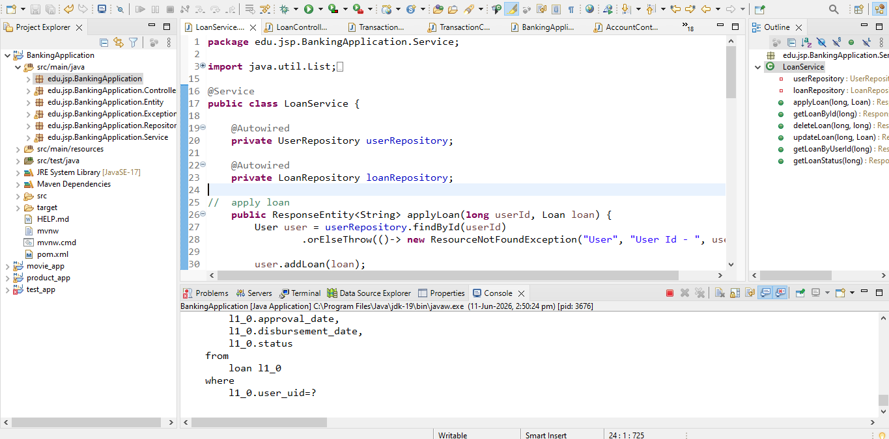
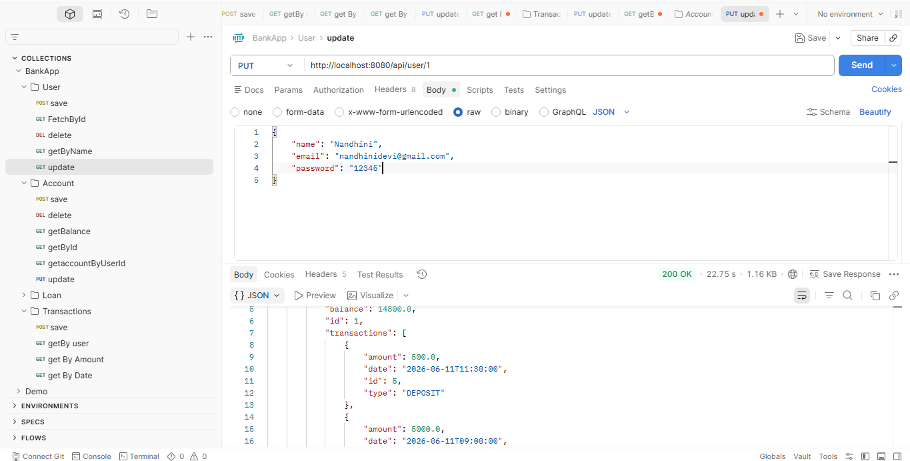
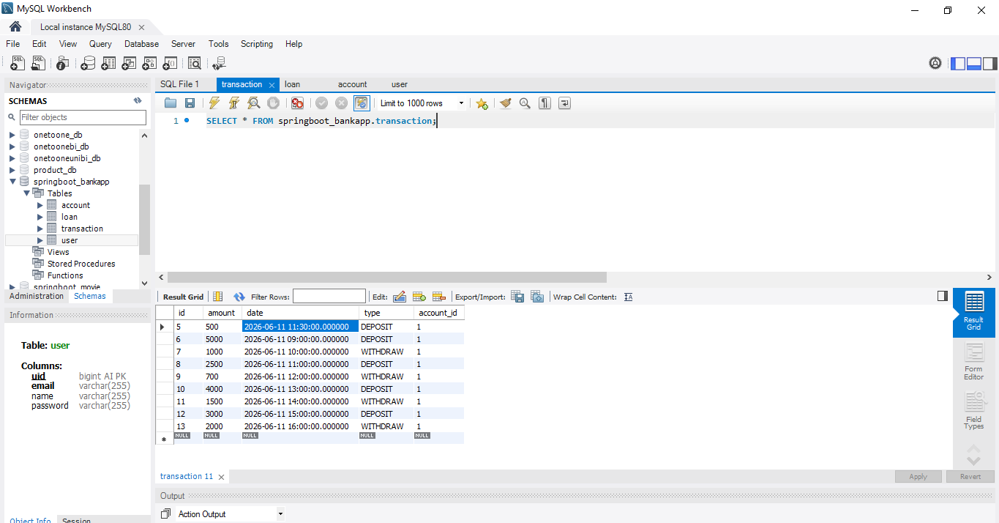

# 🏦 Banking Application (Spring Boot)

A RESTful Banking System developed using Spring Boot, Spring Data JPA, and MySQL.  
This project handles Users, Accounts, Transactions, and Loans with proper relationships, validations, and exception handling.

---

## 🚀 Technologies Used

- Java 17+
- Spring Boot
- Spring Web (REST APIs)
- Spring Data JPA
- Hibernate
- MySQL
- Maven
- Postman (API Testing)

---

## 📌 Features

### 👤 User Module
- Create user
- Get user by ID
- Update user
- Delete user
- Search user by name

### 🏦 Account Module
- Create account for user
- Get account by ID
- Get accounts by user ID
- Delete account
- Check account balance

### 💰 Transaction Module
- Deposit money
- Withdraw money (with balance validation)
- Get transactions by user (Pagination support)
- Filter transactions by amount range
- Filter transactions by date range

### 🏠 Loan Module
- Apply loan
- Get loan by ID
- Get loans by user ID
- Check loan status
- Delete loan

---

## 🗂️ Project Structure


edu.jsp.BankingApplication
│
├── Controller
├── Service
├── Repository
├── Entity
├── Exception


---

## ⚙️ Database Configuration

### application.properties (Local Setup)

```properties
spring.application.name=BankingApplication

spring.datasource.url=jdbc:mysql://localhost:3306/springboot_bank
spring.datasource.username=your_username
spring.datasource.password=your_password

spring.jpa.hibernate.ddl-auto=update
spring.jpa.properties.hibernate.format_sql=true
spring.jpa.show-sql=true

📸 Screenshots
🖥️ Eclipse (Project Structure)
Shows full backend structure like Controller, Service, Repository, Entity, Exception.

📌 Screenshot:


📬 Postman (API Testing)
Shows API requests and responses for:

User APIs
Account APIs
Transaction APIs
Loan APIs

📌 Screenshot:


🗄️ Database (MySQL)
Shows tables:
  user
  account
  transaction
  loan

📌 Screenshot:


🔥 API Endpoints

👤 User APIs
POST   /api/user
GET    /api/user/{id}
PUT    /api/user/{id}
DELETE /api/user/{id}
GET    /api/user/byName/{name}

🏦 Account APIs
POST   /api/account/{userId}
GET    /api/account/{accountId}
DELETE /api/account
GET    /api/account/getBalance/{accountId}
GET    /api/account/getAccountByUserId/{userId}

💰 Transaction APIs
POST   /api/transaction/account/{accountId}
GET    /api/transaction/user/{userId}?pageno=0&pageSize=3
GET    /api/transaction/user/{userId}/amount?st=&end=
GET    /api/transaction/user/{userId}/date?st=&end=

🏠 Loan APIs
POST   /api/loan/{userId}
GET    /api/loan/{id}
GET    /api/loan/getByUserId/{userId}
GET    /api/loan/getStatus/{loanId}
DELETE /api/loan/user/{userId}/loan/{loanId}

📊 Validation & Exception Handling
@Valid used for input validation
@ControllerAdvice for global exception handling
Custom Exception: ResourceNotFoundException

⚠️ Important Notes
Email must be UNIQUE for each user
Account number must be UNIQUE
Transactions update account balance
Withdraw not allowed if balance is insufficient

🧠 Learning Outcome
This project demonstrates:
Spring Boot REST API development
Entity relationships (OneToMany, ManyToOne)
Transaction handling
Pagination and filtering
Exception handlingucture
